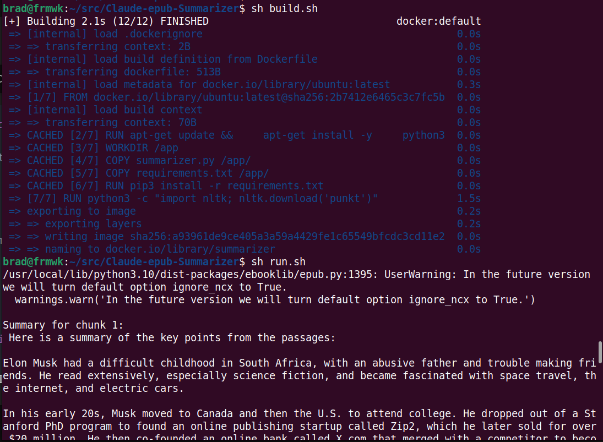

# Claude-epub-Summarizer
A sample project using the anthropic/claude API to summarize epub books

## Install

* install docker
* Get access to the claude API from anthropic
* Set an environment variable on your machine ```ANTHROPIC_API_KEY```

## Add your .epub files to the project folder


## Build and Run

* ```cd``` to project folder
* ```bash build.sh```
* ```bash run.sh```

## Sample output


